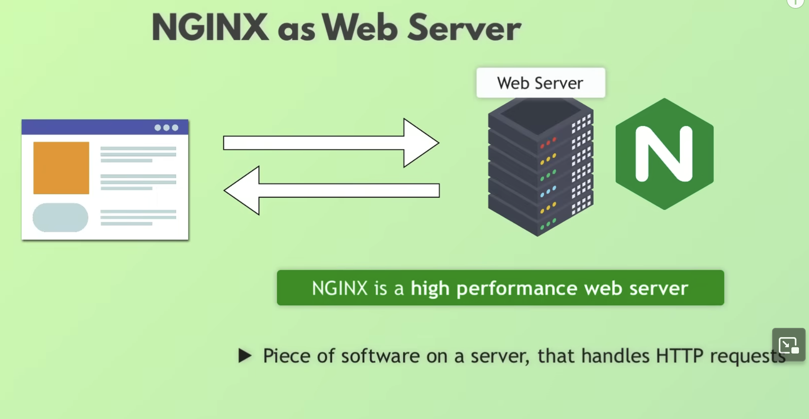
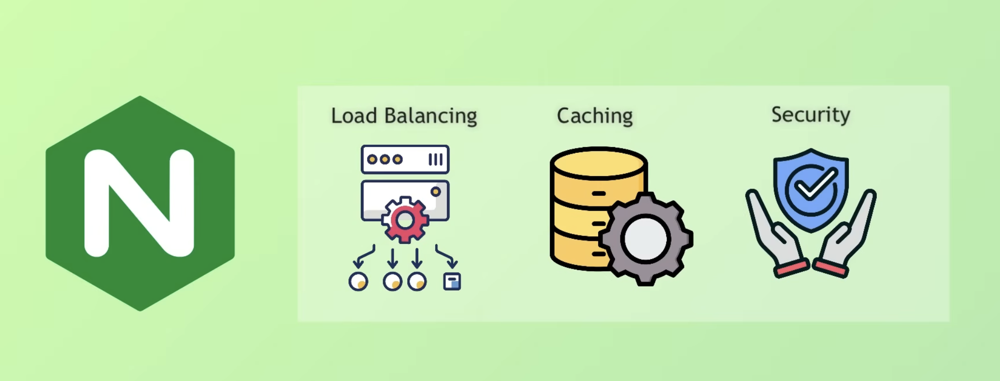
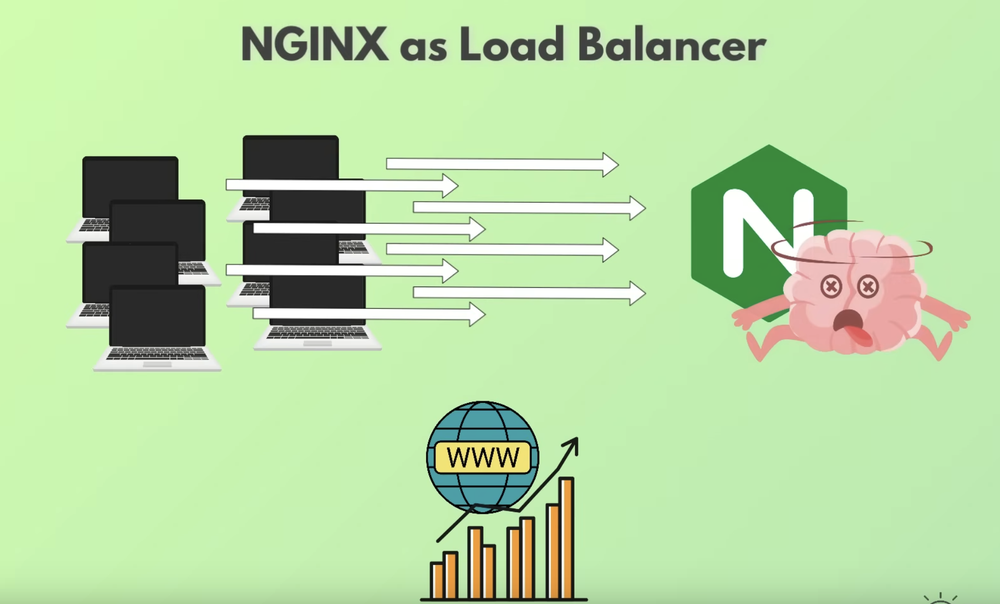
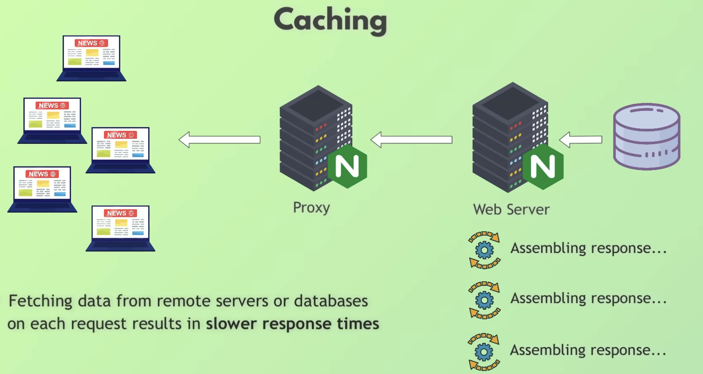
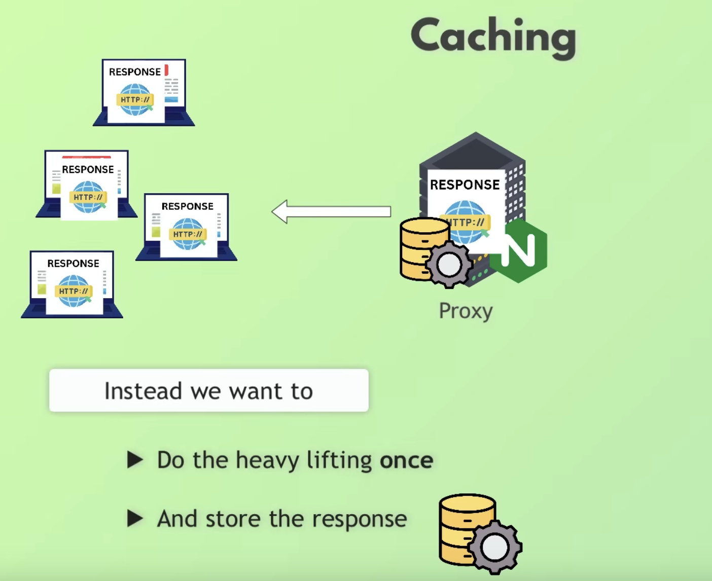
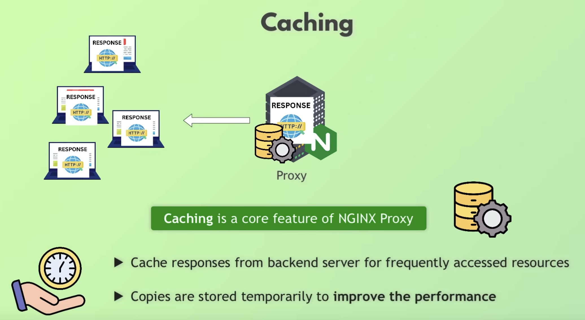
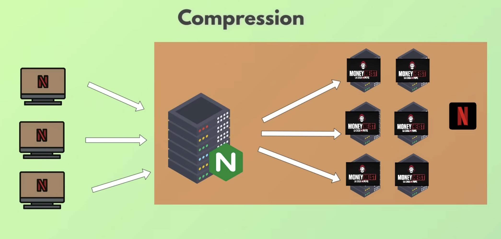
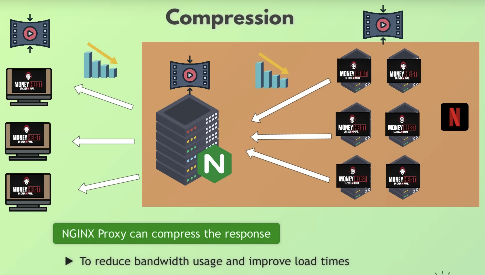
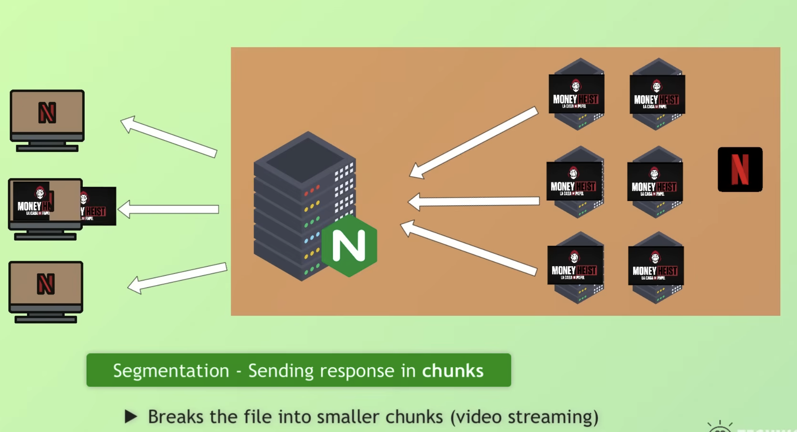
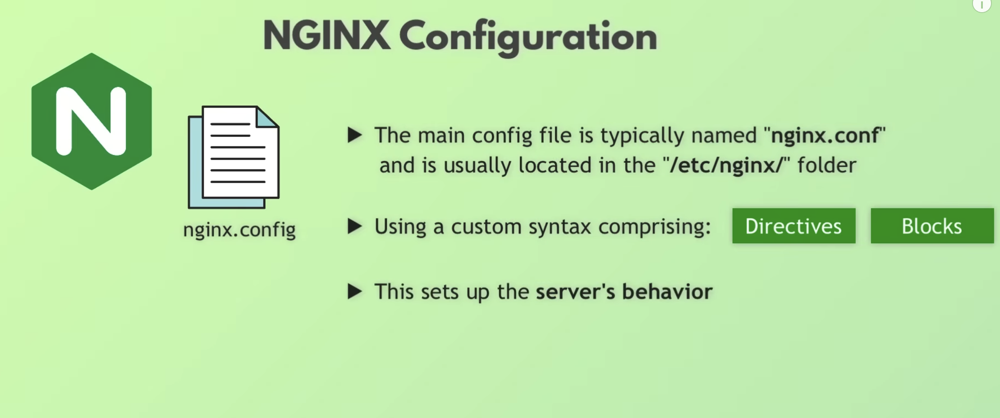

# NGINX

### NGINX as a webserver.

Back in the day, when the internet was still simple, with less users, the basic use case was:

- a browser requestes a web page from a web server (web server refers to both the physical machine and software running on the machine)

- The web server assembled the page and send it back to the browser, which then displays it to the user.

NGINX would be this server software that responds to client HTTP requests.

### NGINX as a a proxy server.

When web became popular, we have thousands or millions of requests per website. Imagine one single server handling millions of requests...

We need a few more servers to handle the load, so we add 10 NGINX webservers..

But now we need something that determines where requests from the browser end. Which one of those 10 servers will handle them.

This is where load balancing comes in.. We can use another NGINX as a load balances that proxies the requests to those 10 servers.

(proxy = "acting on behalf of another")
(proxy server = "intermediary server that forwards client requests to other servers")

The load is distributed based on whichever algorithm was defined on it. Some examples are:

- lest connections (routes traffic to the server with the fewest active connections)
- round robin (distributes client requests in a sequential, cyclical manner to each server in the group)

### Loadbalancing is just one functionality of a proxy server. Let's look at caching now

Imagine that a New York Times article comes out and million of people open it. The normal flow would be:

- Every time a request landed with one of the web servers, it would assemble the response (put images together, get them from database, add all links, etc..) and it would happen millions of times for each request. 

That seems pretty inneficient. Caching allow us to do the heavy lifting only once (get all the data from db, put the text together, images, etc..) and store the response.

### A single entrypoint

Imagine we have 100's of servers of an online banking app or a social network like facebook. 

That makes those servers a pretty juicy target for hackers, like personal data, banking data, etc...

Imagine you exposed all 100's servers to public access... all those requests would be able to directly hit each of the web servers...

We want to reduce the risk by providing only one server that is publicly acessible. We can put all our security efforts into one server instead of 100's.

Having only one entrypoint (the proxy) as publicly acessible reduces the secuirty attack surface tremendously and acts like a shield or security layer.

### Encrypted communications

One very important security measure is encrypted communication.

- NGINX can handle SSL/TLS encryption and decryption

The browser will send encrypted message to the proxy - which means, even if attacker intercepts message, they can't read it - only the proxy server can decrypt it or for added security (when proxy acts as shield) it will pass that encrypted message into the web servers.

We can configure the proxy to deny any requests that is not encrypted and only accept encrypted requests.

### Compression

Now, imagine NetFlix - which , by the way , uses NGINX on it's backend - has millions of users and millions of requests for videos on it's webservers.

Millions of requests are sent for a high quality video to NetFlix. Imagine if NGINX proxy server would have to send back the entire high bquality video to millions of users at once (that's a lot of bandwidth - imagine how long it would take) and that's where compressions helps.

NGINX proxy can also BE CONFIGURED TO COMPRESS LARGE IMAGES OR VIDEO FILES TO SAVE BANDWIDTH , BOTH ON THE receiving end and on the server side.

It also support chuncking (segmentation - sending response in chuncks)

# How to setup NGINX

Using NGINX configuration

Here you define wether you want your NGINX to act as a web server or a proxy server by configuring where it should forward the traffic to or if it should handle it itself. 

Here, we redirect all traffic received in port 80 (http) to 443 (https) and we serve content over SSL/TLS (configured):

On the next image, we configure load balancing to multiple backend servers and within that configuration you can define which load balancing algo to use..

On the next one, you can see the caching configuration example:

You can see the full list of all configuration blocks and directives here:

https://nginx.org/en/docs/

### NGINX in Kubernetes - NGINX as k8'S ingress controller

NGINX ingress controller is used inside the cluster, so unlike the proxy for web servers it is not publicly acessible
